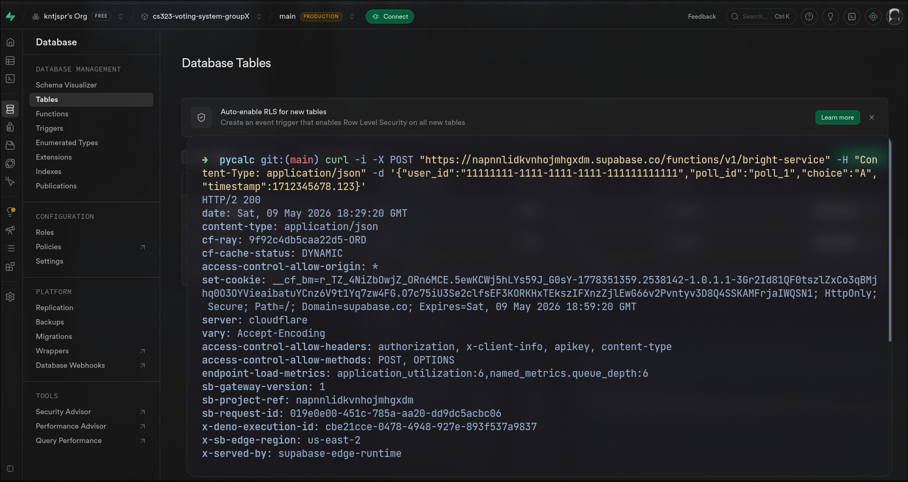

# Distributed Voting System with Edge–Cloud Architecture and Fault Tolerance using GCP

## Group 6ix-9ine
| Name | GitHub |
|------|--------|
| BONIEL, Gerald D. | [@geraldnofuckstogive666](https://github.com/geraldnofuckstogive666) |
| LERIO, Jars Christian | [@jars-ofclay](https://github.com/jars-ofclay) |
| SISI, Kent Jasper | [@kntjspr](https://github.com/kntjspr) |
| SORONGON, Charles Juvanne | [@charlesgiovanne](https://github.com/charlesgiovanne) |

---

## System Overview

This project implements a distributed voting system built on Google Cloud Platform (GCP). The system simulates multiple edge nodes independently generating votes and sending them to a cloud pipeline for processing and storage. The architecture is designed to remain functional even when individual components fail, demonstrating key distributed systems principles such as fault tolerance, eventual consistency, and idempotency.

The system follows an event-driven pipeline:

```
Edge Nodes → Cloud Run API → Pub/Sub → Worker Service → Firestore
```

- **Edge Nodes** simulate independent user devices that generate and transmit vote data via HTTP POST requests to the Cloud Run API. Each node runs independently and includes retry logic to handle network failures.
- **Cloud Run API** acts as the ingestion layer. It receives and validates incoming votes, then publishes them to a Pub/Sub topic asynchronously without waiting for processing.
- **Pub/Sub** serves as the message broker between the API and the worker. It decouples the ingestion and processing layers and buffers messages during worker downtime, enabling fault-tolerant delivery.
- **Worker Service** subscribes to the Pub/Sub topic, processes each message, enforces idempotency using a composite document ID (`user_id_poll_id`), and writes the final result to Firestore.
- **Firestore** is the persistent storage layer where all processed votes are stored as documents, each uniquely identified to prevent duplicate entries.

---

## System Architecture Diagram

```
┌─────────────────────────────────────────────────────────────┐
│                        EDGE LAYER                           │
│                                                             │
│   [Edge Node 1]   [Edge Node 2]   [Edge Node 3]  ...        │
│   generate_vote() generate_vote() generate_vote()           │
│   send_vote()     send_vote()     send_vote()               │
│        │               │               │                    │
└────────┼───────────────┼───────────────┼────────────────────┘
         │   HTTP POST /vote             │
         └───────────────┴───────────────┘
                         │
                         ▼
┌─────────────────────────────────────────────────────────────┐
│                  CLOUD RUN API (Ingestion)                   │
│                                                             │
│   POST /vote → validate → publish to Pub/Sub                │
│   Returns 200 Accepted (non-blocking)                       │
└─────────────────────────┬───────────────────────────────────┘
                          │ publish
                          ▼
┌─────────────────────────────────────────────────────────────┐
│                   PUB/SUB (Message Broker)                  │
│                                                             │
│   Topic: vote-topic                                         │
│   Subscription: vote-sub (Pull)                             │
│   Buffers messages during worker downtime                   │
└─────────────────────────┬───────────────────────────────────┘
                          │ pull / subscribe
                          ▼
┌─────────────────────────────────────────────────────────────┐
│               WORKER SERVICE (Processing)                   │
│                                                             │
│   decode → idempotency check → write to Firestore           │
│   doc_id = user_id + "_" + poll_id                          │
│   message.ack() on success                                  │
└─────────────────────────┬───────────────────────────────────┘
                          │ set(vote)
                          ▼
┌─────────────────────────────────────────────────────────────┐
│                  FIRESTORE (Storage)                        │
│                                                             │
│   Collection: group02-votes                                 │
│   Document ID: {user_id}_{poll_id}                          │
│   Idempotent writes — duplicates overwrite same document    │
└─────────────────────────────────────────────────────────────┘
```

---

## Setup and Execution Instructions

### Prerequisites
- A Google account with access to [Google Cloud Console](https://console.cloud.google.com)
- Python 3.9 or higher installed locally
- `gcloud` CLI installed and authenticated

---

### Step 1: Create GCP Project

1. Go to [https://console.cloud.google.com](https://console.cloud.google.com)
2. Create a new project named: `cs323-voting-system-group6`
3. Set it as the active project in the top navigation bar

---

### Step 2: Enable Required Services

Navigate to **APIs & Services → Library** and enable the following:
- Cloud Run API
- Pub/Sub API
- Firestore API

---

### Step 3: Create Firestore Database

1. Go to **Firestore Database** → **Create Database**
2. Select **Native Mode**
3. Choose region: `asia-southeast1`

---

### Step 4: Create Pub/Sub Topic and Subscription

1. Go to **Pub/Sub → Topics** → Create topic named: `vote-topic`
2. Create a subscription named: `vote-sub`
3. Set subscription type to **Pull**

---

### Step 5: Deploy the Cloud Run API

Navigate to the `cloud_api/` directory:

```bash
cd Fin-Lab-02/distributed-voting-system/cloud_api
```

Deploy to Cloud Run:

```bash
gcloud run deploy cloud-api \
  --source . \
  --region asia-southeast1 \
  --allow-unauthenticated
```

After deployment, copy the generated Cloud Run URL. You will need it for the edge node.

---

### Step 6: Deploy the Worker Service

Navigate to the `worker_service/` directory:

```bash
cd Fin-Lab-02/distributed-voting-system/worker_service
```

Deploy to Cloud Run:

```bash
gcloud run deploy worker-service \
  --source . \
  --region asia-southeast1 \
  --allow-unauthenticated
```

---

### Step 7: Run the Edge Node

Navigate to the `edge_node/` directory:

```bash
cd Fin-Lab-02/distributed-voting-system/edge_node
```

Install dependencies:

```bash
pip install requests
```

Update the `API_URL` variable in `edge_node.py` with your deployed Cloud Run API URL, then run:

```bash
python edge_node.py
```

Each group member should run this script independently to simulate multiple concurrent edge nodes.

---

## Deployed Cloud Run API Endpoint

```
https://napnnlidkvnhojmhgxdm.supabase.co/functions/v1/bright-service
```

curl command
```
curl -i -X POST "https://napnnlidkvnhojmhgxdm.supabase.co/functions/v1/bright-service" -H "Content-Type: application/json" -d '{"user_id":"11111111-1111-1111-1111-111111111111","poll_id":"poll_1","choice":"A","timestamp":1712345678.123}'
```

api endpoint response:



---


## Demonstration

> Insert your system demo GIF or video here showing:
> - Vote generation at edge nodes
> - API ingestion via Cloud Run
> - Message flow through Pub/Sub
> - Worker processing
> - Firestore updates in real time

---

## Individual Reflections

- [BONIEL.md](docs/Boniel.md)
- [LERIO.md](docs/LERIO.md)
- [SISI.md](docs/SISI.md)
- [SORONGON.md](docs/SORONGON.md)
