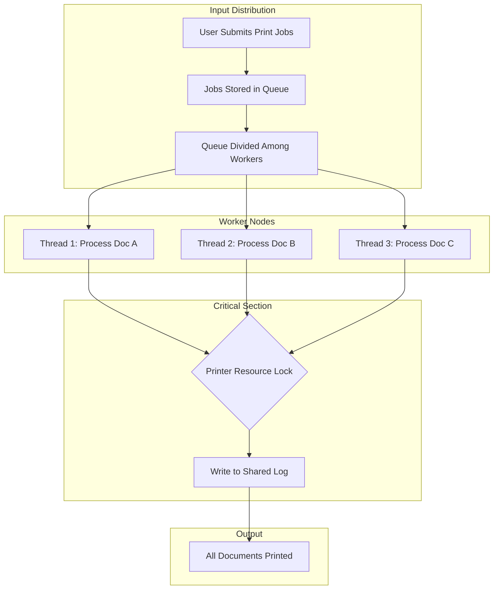

Members:
- Boniel, Gerald
- Lerio, Jars Christian
- Sisi, Kent Jasper
- Sorongon, Charles Juvanne

# Real-World Bottleneck: Internet Café Printing Queue

## The Bottleneck
In an internet café printing queue, the current bottleneck occurs because a single staff member manages the entire printing workflow from beginning to end. This person is responsible for receiving files from customers, checking formatting and layout settings, selecting print options, sending the job to the printer, monitoring the printing process, and sometimes even handling payment afterward. Because all of these steps are handled by one individual, print jobs are processed strictly in sequence. Even if multiple customers are waiting or multiple computers are available, only one document can be processed at a time. The bottleneck therefore lies in the centralized control of the workflow, where one processing unit becomes the limiting factor in the system’s performance.

## Why it limits efficiency
This setup limits efficiency because it creates unnecessary delays and prevents the system from utilizing available resources. Customers must wait in line regardless of whether their print jobs are large or small, simple or complex. A one-page document takes its turn just like a lengthy file, which increases total waiting time for everyone. During peak hours, such as after school or during project deadlines, the queue can grow significantly longer, causing frustration and reduced productivity. Additionally, even if the café has multiple printers or capable computers, these resources may remain underused because the workflow does not allow simultaneous processing.

## Parallel Mapping (Computational Model)
The improvement requires **data parallelism**. Printing multiple documents involves applying the same operation to different pieces of data, where each document represents an independent unit of work.

### Define the Work Unit
The smallest independent unit of computation in this model is one print job (one document). Each document can be processed independently because printing one file does not depend on another.

### Identify System Constraints
Parallelism is limited by several practical constraints:
- **Shared Resources:** The printer itself cannot handle unlimited simultaneous requests.
- **Synchronization Overhead:** Multiple threads attempting to access the print queue simultaneously require coordination.
- **Thread Management:** Context switching introduces computational overhead.

### Parallel Strategy
Data parallelism is used to apply the same operation (printing) to multiple independent inputs. The list of print jobs is partitioned and distributed among multiple worker threads. However, a critical section remains when accessing the shared printer resource.

## Workflow Flowchart

## Benchmark Report (Simulation)
The following data represents a simulation with 20 documents and 4 worker threads.

- **Total Documents:** 20
- **Number of Workers:** 4
- **Sequential Version:** 10.0 seconds (0.5s per doc)
- **Parallel Version:** ~10.5 seconds
- **Speedup:** ~0.95x
- **Parallel Efficiency:** ~23.75%

### Analysis
Speedup is less than 1x because all threads must wait for the printer lock. Adding more workers does not improve performance beyond a point due to the shared resource bottleneck. Thread management and context switching introduce minor overhead, making the parallel version slightly slower in this specific bottleneck-heavy scenario.
